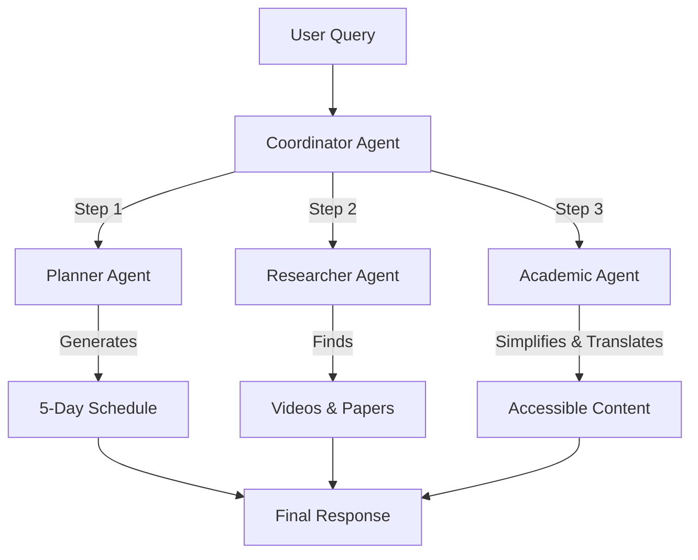

# ADK Study Planner 🎓
### Your Personal AI Study Companion for Personalized Learning

**Track:** Agents for Good (Education)

## 📖 Overview

**ADK Study Planner** is an intelligent multi-agent system designed to help students organize their learning, discover high-quality resources, and understand complex academic concepts. By leveraging the power of Google's Agent Development Kit (ADK) and Gemini models, it creates a personalized learning experience that adapts to the student's topic, grade level, and language preferences.

## 🚩 Problem Statement

Students often face three main challenges:
1.  **Overwhelm:** Breaking down complex topics into manageable study sessions is difficult.
2.  **Resource Discovery:** Finding reliable educational videos and academic papers takes time.
3.  **Accessibility:** Academic language can be dense and hard to understand, especially for non-native speakers.

## 💡 Solution

The **ADK Study Planner** solves these problems with a coordinated team of AI agents:
1.  **Planner Agent:** Generates a structured 5-day study schedule with clear learning objectives.
2.  **Researcher Agent:** Curates relevant YouTube videos and finds the latest academic papers on the topic.
3.  **Academic Agent:** Simplifies complex abstracts and translates explanations into the student's native language (e.g., Persian).

## 🏗️ Architecture

The system uses a **Sequential Multi-Agent Architecture** orchestrated by a root coordinator agent.



### Agents & Tools
*   **Planner Agent**: Uses `gemini-2.5-flash-lite` to structure learning paths.
*   **Researcher Agent**: Equipped with:
    *   `google_search`: To find educational videos.
    *   `search_arxiv`: A custom tool to fetch relevant academic papers.
*   **Academic Agent**: Specialized in simplification and translation.

## 🔑 Key Features (Capstone Concepts)

This project demonstrates the following key concepts from the AI Agents Intensive:

1.  **Multi-Agent System**: A sequential workflow where agents pass information and build upon each other's work.
2.  **Tools**:
    *   **Built-in**: `google_search` for video discovery.
    *   **Custom**: `search_arxiv` tool using the Arxiv API for academic research.
3.  **Sessions & Memory**: Uses `InMemorySessionService` to maintain conversation context and user preferences across the workflow.

## 🚀 Setup & Usage

### Prerequisites
*   Python 3.10+
*   Node.js & npm (for the web interface)
*   Google Cloud Project with Vertex AI API enabled (or AI Studio API Key)

### 1. Core Agent Setup

1.  **Clone the repository:**
    ```bash
    git clone https://github.com/snowholt/Study-Planner.git
    cd Study-Planner/adk-study-planner
    ```

2.  **Install Python dependencies:**
    ```bash
    pip install -r requirements.txt
    ```

3.  **Configure Environment:**
    Create a `.env` file in the `adk-study-planner` directory:
    ```env
    GOOGLE_API_KEY=your_api_key_here
    ```

4.  **Run the CLI Agent:**
    ```bash
    python src/main.py
    ```

### 2. Web Application Setup (Optional)

To run the full web interface with chat history and user management:

**Step A: Start the ADK Server**
```bash
# In adk-study-planner directory
adk run src/main.py:root_agent --port 8081
```

**Step B: Start the Backend API**
```bash
cd webapp/backend
pip install -r requirements.txt
uvicorn main:app --reload --port 8000
```

**Step C: Start the Frontend**
```bash
cd webapp/frontend
npm install
npm run dev
```
Access the web app at `http://localhost:5173`.

## 📄 Example Output

**Query:** "Topic: Quantum Physics, Grade: 10, Language: Persian"

**Result:**
*   **Day 1-5 Plan:** Introduction to particles, wave-particle duality, etc.
*   **Resources:** Links to "Quantum Physics for Babies" video, Arxiv paper on Quantum Education.
*   **Simplified Content:** "Quantum entanglement is like having two magic dice..." translated to Persian.

## 🏆 Submission Details

This project is submitted for the **Agents Intensive Capstone Project**.
*   **Track:** Agents for Good
*   **Team:** Individual
